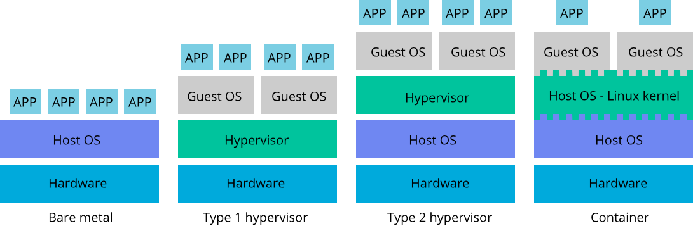
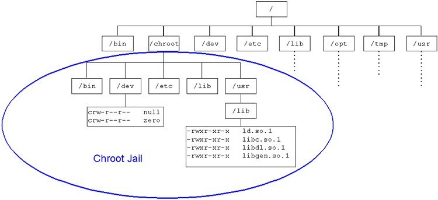

# Docker essentials

Containers offer a logical packaging mechanism in which applications can be abstracted from the environment in which they actually run. This decoupling allows container-based applications to be deployed easily and consistently, regardless of whether the target environment is a private data center, the public cloud, or even a developer’s personal laptop. Containerization provides a clean separation of concerns, as developers focus on their application logic and dependencies, while IT operations teams can focus on deployment and management without bothering with application details such as specific software versions and configurations specific to the app.

## The problems for developers

- **Consistent environment**   
  Ability to create predictable environments that are isolated from other applications.
- **Run anywhere**   
  Ability to run virtually anywhere: on Linux, Windows, and Mac operating systems; on virtual machines or bare metal; on a developer’s machine or in data centers on-premises; in the public cloud.
- **Isolation**
  Ability to virtualize CPU, memory, storage, and network resources at the OS level, providing developers with a sandboxed view of the OS logically isolated from other applications.

## What is Cloud?

- Remote public data centers
- Offers software and hardware to a business or individual
- IaaS, PaaS, SaaS, MLaaS, ...
- Web-based and API driven\
  [Bezos API Mandate](https://nordicapis.com/the-bezos-api-mandate-amazons-manifesto-for-externalization/): Anyone who doesn’t do this will be fired
- Mostly virtualized
- Private Cloud, mostly based on OpenStack and Kubernetes

## Why business is moving to the Cloud?

- **Flexibility and agility**   
  Cloud computing makes it easy to quickly scale up/down the capacity.
- **Security**   
  Implement effective disaster recovery solutions without large, upfront investments.
- **Automatic software and hardware updates**   
  The servers are maintained by your supplier.
- **Saves money on hardware, “pay as you go”**
- **Increased collaboration**   
  Team members can work anywhere.
- **Сompetitive advantage**   
  Small businesses have access to enterprise-class technology they couldn’t afford on their own.

[Read more](https://www.pointclick.net/moving-to-the-cloud/)

## [CNCF Cloud Native Definition v1.0](https://github.com/cncf/toc/blob/main/DEFINITION.md)

- Cloud-native technologies empower organizations to build and run **scalable applications** in , **dynamic environments** such as public, private, and hybrid clouds. Containers, service meshes, microservices, immutable infrastructure, and declarative APIs exemplify this approach.

- These techniques enable **loosely coupled systems** that are resilient, manageable, and observable. Combined with robust automation, they allow engineers to make high-impact changes frequently and predictably with minimal toil.

- The Cloud Native Computing Foundation seeks to drive adoption of this paradigm by **fostering and sustaining an ecosystem of open-source, vendor-neutral projects**. We democratize **state-of-the-art patterns** to make these innovations accessible for everyone.

## [Attributes of cloud-native applications](https://thenewstack.io/10-key-attributes-of-cloud-native-applications/)

**Key:**

1. Packaged as lightweight **containers**.
2. Developed with best-of-breed **languages and frameworks**.
3. Designed as **loosely coupled microservices**.

**Other attributes:**

4. **Centered around APIs** for interaction and collaboration.
5. **Architected** with a clean separation of **stateless and stateful** services.
6. **Isolated** from the server and operating system dependencies.
7. **Deployed** on self-service, elastic, cloud infrastructure.
8. **Managed** through agile DevOps processes   
    Each service has an independent life cycle and CI/CD.
9. **Automated** capabilities
10. Defined, **policy-driven resource allocation**.

## The machine landscape

Nodes can be made of multiple technologies.
- **bare-metal**:
  - Hardware provisioning.
- **Type 1 hypervisors** or “bare-metal” hypervisor
  - Runs directly on the physical hardware.
  - Direct access to the underlying hardware.
  - Best performing and most efficient, most secured virtualization.
  - eg: Citrix/Xen Server, VMware ESXi, and Microsoft Hyper-V.
- **Type 2 hypervisors**
  - Run over an existing Operating System.
  - eg: Microsoft Virtual PC, Oracle Virtual Box, VMware Workstation/Fusion, ...
- **KVM hypervisor** is a special beast
  - Provide advantages of type 1.
  - Run-on a fully functional Operating System.
- **Containers**
  - Run inside the Linux Kernel.
  - Limited to Linux, lower security with a greater surface of attack.

Virtualization requires a hypervisor
- Enables multiple operating systems to run side-by-side.
- Orchestrates, separates, allocates the available resources (computing power, memory, storage, ...).

From a functional point of view, the Docker daemon behaves like a hypervisor and Kubernetes behave like a distributed hypervisor.

## What are containers?

- **Standardized unit of software** that allows developers to isolate their application from its environment.
- **Packages code and all its dependencies**, so that the application runs quickly and reliably from one computing environment to another.
- Container runtimes:   
  - **Docker**
  - LXC/LXD (Linux Containers)
  - containerd, CRI-O, and any implementation of the Kubernetes CRI (Container Runtime Interface)

## Containerization history

- 1979: Chroot Jail ("change root", in Unix 7)   
  Isolates a process and its children, but the root process could easily exit the chroot
- 2000: The FreeBSD Jail   
  Isolates also the processes and their activities to a particular view of the filesystem
- 2001: Linux VServer
- 2004: Oracle Solaris Containers
- 2005: OpenVZ
- 2007: Process Containers (CGroups)
- 2008: LXC
- 2013: Warden
- 2013: Docker
- 2014: LMCTFY, RKT

[Read more](https://faun.pub/the-missing-introduction-to-containerization-de1fbb73efc5)

## Docker didn't create the wheel, it packaged the car

- `cgroups`

  Manage and monitor resource allocation for a given process and set resource limits, like CPU, memory, and network limits.

- Namespaces
  Partitions kernel resources such that one set of [processes](https://en.wikipedia.org/wiki/Process_(computing)) sees one set of resources while another set of processes sees a different set of resources. Examples of such resources are process IDs, hostnames, user IDs, file names, and some names associated with network access, and [interprocess communication](https://en.wikipedia.org/wiki/Interprocess_communication). There are six default namespaces in Linux: mnt, IPC, net, usr, pid, and uts
  
- Network isolation (via libnetwork)

  Allows for separate virtual interfaces and IP addressing between containers

- `chroot jail`

  Provide a root file system to each container

- Overlay File System (Union File System)

  Allows multiple layers of files and directories to be overlaid

## Don't Panic: Kubernetes and Docker

- Docker deprecated in Kubernetes since version 1.20, December 2020
- Replaced by Container Runtime Interface (CRI)
- Image continue itself
- Docker, the tool and its associated tools, use OCI
- Continue to use `docker` to build images
- Continue to use `docker` and `docker-compose` to set up your development environment 

## Container landscape

Two main standards to be aware of:

- Kubernetes Container Runtime Interface (CRI)
  
  Defines an API between Kubernetes and the container runtime
  
- Open Container Initiative (OCI)
  
  Publishes specifications for images and containers

