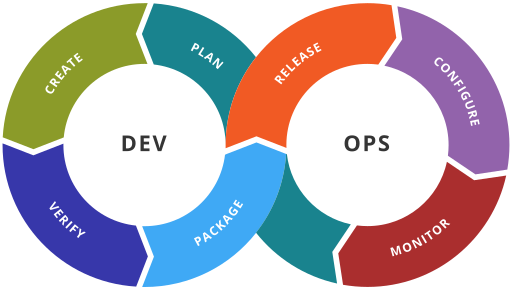

# Introduction

Containers offer a logical packaging mechanism in which applications can be abstracted from the environment in which they actually run. This decoupling allows container-based applications to be deployed easily and consistently, regardless of whether the target environment is a private data center, the public cloud, or even a developer’s personal laptop. Containerization provides a clean separation of concerns, as developers focus on their application logic and dependencies, while IT operations teams can focus on deployment and management without bothering with application details such as specific software versions and configurations specific to the app.

## The problems for developers

- **Consistent environment**   
  Ability to create predictable environments that are isolated from other applications.
- **Run anywhere**   
  Ability to run virtually anywhere: on Linux, Windows, and Mac operating systems; on virtual machines or bare metal; on a developer’s machine or in data centers on-premises; in the public cloud.
- **Isolation**
  Ability to virtualize CPU, memory, storage, and network resources at the OS level, providing developers with a sandboxed view of the OS logically isolated from other applications.

## What are containers?

- Standardized unit of software that allows developers to isolate their application from its environment.
- Packages code and all its dependencies, so that the application runs quickly and reliably from one computing environment to another.
- Container platforms:   
  - **Docker**
  - LXC (Linux Containers)
  - rkt (CoreOS Rocket)

## Containerization history

- 1979: Chroot Jail ("change root", in Unix 7)   
  Isolates a process and its children, but the root process could easily exit the chroot
- 2000: The FreeBSD Jail   
  Isolates also the processes and their activities to a particular view of the filesystem
- 2001: Linux VServer
- 2004: Oracle Solaris Containers
- 2005: OpenVZ
- 2007: Process Containers (CGroups)
- 2008: LXC
- 2013: Warden
- 2013: Docker
- 2014: LMCTFY, RKT

[Read more](https://faun.pub/the-missing-introduction-to-containerization-de1fbb73efc5)

## Chroot Jail

## Docker history

- Docker Inc. was founded by Kamel Founadi, Solomon Hykes, and Sebastien Pahl during the Y Combinator Summer 2010 startup incubator group and launched in 2011
- released as open-source in March 2013
- it used LXC as its default execution environment before Docker 0.9 (with "libcontainer")

## What is Cloud?

- Remote data centers
- Offers software or hardware to a business or individual
- You can access it through the Internet

## Why business is moving to the Cloud?

- **Flexibility and agility**   
  Cloud computing makes it easy to quickly scale up/down the capacity.
- **Security**   
  Implement effective disaster recovery solutions without large, upfront investments.
- **Automatic software and hardware updates**   
  The servers are maintained by your supplier.
- **Saves money on hardware, “pay as you go”**
- **Increased collaboration**   
  Team members can work anywhere.
- **Сompetitive advantage**   
  Small businesses have access to enterprise-class technology they couldn’t afford on their own.
  
[Read more](https://www.pointclick.net/moving-to-the-cloud/)

## Cloud-native applications

- a collection of small, independent, and loosely coupled services
- providing a consistent development and automated management
- designed to run in the cloud

## Attributes of cloud-native applications

**Key:**

1. Packaged as lightweight **containers**
2. Developed with best-of-breed **languages and frameworks**
3. Designed as **loosely coupled microservices**

**Other attributes:**

4. **Centered around APIs** for interaction and collaboration
5. **Architected** with a clean separation of **stateless and stateful** services
6. **Isolated** from the server and operating system dependencies
7. **Deployed** on self-service, elastic, cloud infrastructure
8. **Managed** through agile DevOps processes   
  Each service has an independent life cycle and CI/CD.
9. **Automated** capabilities
10. Defined, policy-driven resource allocation

[Read more](https://thenewstack.io/10-key-attributes-of-cloud-native-applications/)

## Docker and DevOps

Docker provides global optimization around software:

- Increase "velocity": developer, integration and deployment flows
- Decrease "variation": infrastructure and application are included in the Docker image
- Provide "visualization": microservices model real world domains

[Read more](https://www.docker.com/resources/white-papers/docker-and-three-ways-devops)

## Example of a Docker workflow

1. Developers write code locally and share their work with their colleagues using Docker containers.
2. They use Docker to push their applications into a test environment and execute automated and manual tests.
3. When developers find bugs, they can fix them in the development environment and redeploy them to the test environment for testing and validation.
4. When testing is complete, getting the fix to the customer is as simple as pushing the updated image to the production environment.
