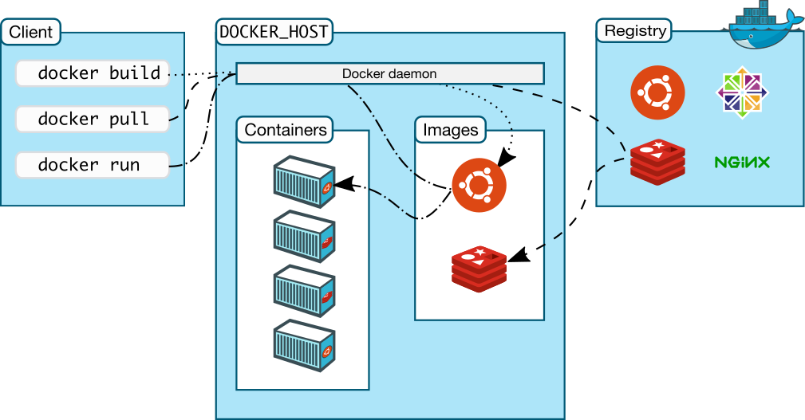

# Docker fundamentals

## Container vs Virtual Machines vs Bare metal

## Docker avantages

  - **Portable anywhere** (Linux, Windows, Datacenter, Cloud, Serverless, etc.)   
  Docker created the industry standard for containers.
  - **Lightweight**   
  Containers share the machine’s OS system kernel and therefore do not require an OS per application, driving higher server efficiencies and reducing server and licensing costs.
  - **Secure**   
  Applications are safer in containers and Docker provides the strongest default isolation capabilities in the industry.

## Namespaces an cgroups

- When running on Linux, Docker uses the resource isolation features of the Linux kernel:
  - cgroups   
    Provide resource limiting for memory and CPU
  - namespaces   
    Isolates an application's view of the operating environment, including process trees, network, user IDs and mounted file systems
- Docker on macOS and Windows uses a Linux virtual machine to run Linux containers

## Docker architecture

- client (CLI via REST API)
- server (Docker host) - daemon, containers, images, volumes
- registry - Docker Hub

## Docker components

**Docker engine:**

- Server (daemon process)
- REST API
- Client (CLI)

**Docker objects**

- Images
- Containers
- Networks
- Volumes
- ... some more objects

Docker objects are available to be observed and controlled using the command `docker <object-name>`.

## Docker Images

- is a read-only template
- contains instructions for creating a Docker container
- (often) is based on another image, with some additional customization

## Docker Containter

- a runnable instance of an image
- you can create/start/stop/move/delete a container
- you can connect a container to one or more networks, attach storage to it, or even create a new image based on its current state.
- (by default) is relatively well isolated from other containers and its host machine
- is defined by its image with any configuration options you provide to it on create or start
- when it is removed, any changes to its state that are not stored in persistent storage disappear

## CLI commands

- `docker help` - explore commands
- `docker ps` - list running containers
- `docker run <CONTAINER_NAME>` - list running containers
- `docker container` - manage containers
- `docker image` - manage images
- `docker volume` - manage volumes
- `docker network` - manage networks
- `docker exec` - run a command in a running container
- ...

Example: `docker run -i -t ubuntu /bin/bash`
